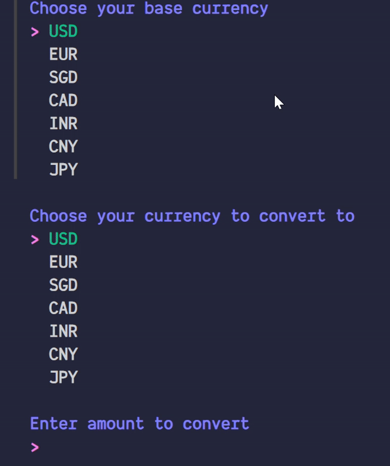

# Currency Converter Documentation

A TUI based conversion tool built with the [huh?](https://github.com/charmbracelet/huh) framework that uses the [FreeCurrencyAPI](https://freecurrencyapi.com/) to provide real-time currency conversion rates.



## Features

- Real-time currency conversion using FreeCurrencyAPI
- Interactive command-line interface
- Support for major currencies including USD, EUR, SGD, CAD, INR, CNY, and JPY
- Easy configuration through environment variables

## Prerequisites

Before using the Currency Converter, ensure you have:

1. A FreeCurrencyAPI account and API key
2. The huh? framework installed on your system
3. Basic familiarity with command-line applications

## Installation

https://user-images.githubusercontent.com/your-user-id/your-repo/assets/video-asset-id/your-video.mp4

### 1. API Key Setup

1. Sign up for a free account at [FreeCurrencyAPI](https://freecurrencyapi.com/)
2. Generate an API key from your dashboard
3. Create a `.env` file in the root directory of the project
4. Add your API key to the `.env` file:

```plaintext
API_KEY=your_api_key
```

**Note:** Keep your API key secure and never commit it to version control.

## Supported Currencies

The application currently supports the following currencies:

- USD (United States Dollar)
- EUR (Euro)
- SGD (Singapore Dollar)
- CAD (Canadian Dollar)
- INR (Indian Rupee)
- CNY (Chinese Yuan)
- JPY (Japanese Yen)

### Adding More Currencies

To add support for additional currencies:

1. Consult the [complete list of supported currencies](https://freecurrencyapi.com/docs/currency-list) in the FreeCurrencyAPI documentation
2. Add the desired currency codes to your implementation

## Usage

Run the application through your command line. The interactive interface will guide you through:

1. Selecting the source currency
2. Selecting the target currency
3. Entering the amount to convert

## API Rate Limits

Be aware of the FreeCurrencyAPI rate limits based on your subscription plan. The free tier typically includes:

- Limited API calls per month
- Real-time exchange rates
- Basic currency support

## Troubleshooting

Common issues and solutions:

1. **API Key Error**

   - Verify your API key is correctly set in the `.env` file
   - Check if the `.env` file is in the root directory

2. **Currency Not Available**
   - Confirm the currency is supported by FreeCurrencyAPI
   - Check if you've added the currency code to the supported list

## Resources

- [FreeCurrencyAPI Documentation](https://freecurrencyapi.com/docs)
- [huh? Framework Documentation](https://github.com/charmbracelet/huh)
- [Complete Currency List](https://freecurrencyapi.com/docs/currency-list)
